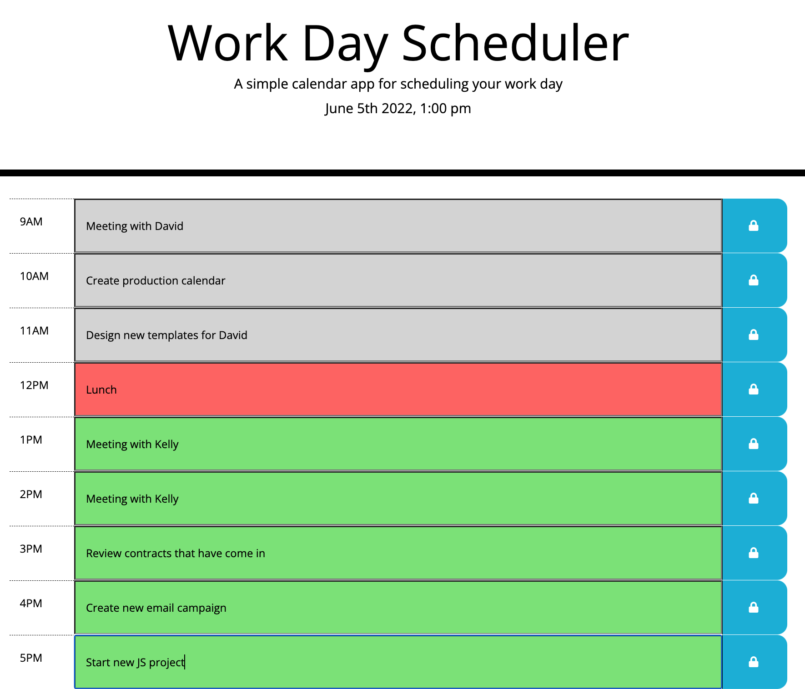
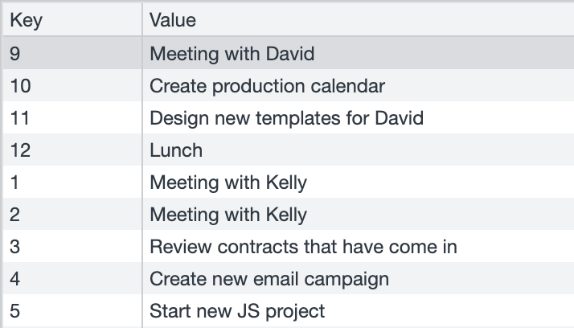

# Work Day Scheduler

A simple calendar application that allows a user to save events for each hour of the day.

Layout and content were built using HTML, CSS, JavaScript, Bootstrap, Moment, JQuery and VS Code.

## Work Day Scheduler Website

## Work Day Scheduler Local Storage

## Website Function:

* When you open the website the current date and time will be displayed at the top of the calendar.

* When you scroll down will see time blocks for each hour of the standard business work day.

* Each hour is color-coded to indicate whether it is in the past, present or future.

* When you click into a time block you can enter your appointments.

* Click the save button (lock icon) and it will be saved in your local storage.

* When you refresh the page the saved appointments persist.

## GitHub repository for Work Day Scheduler
* [Github Repo](https://github.com/joliver521/work-day-scheduler)

## Live website for Work Day Scheduler
* [Live Work Day Scheduler Website](https://joliver521.github.io/work-day-scheduler/)